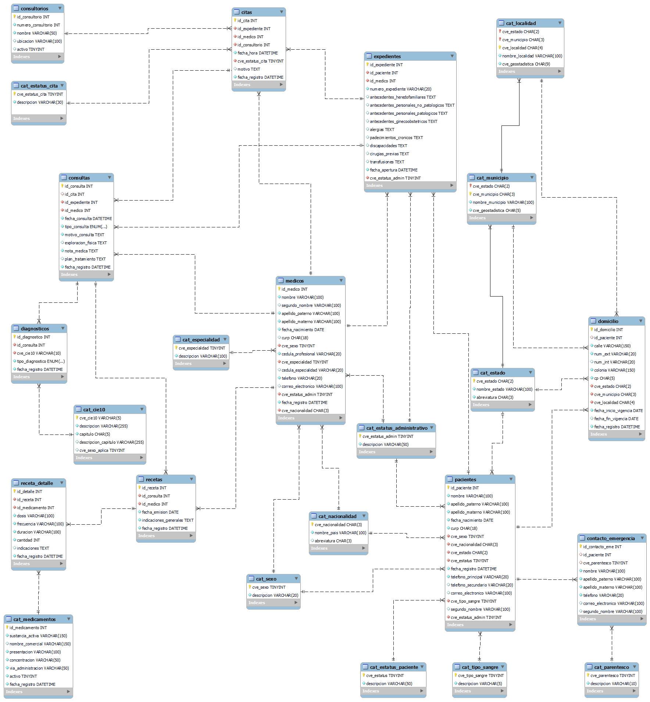

# 🏥 HIS-MX Database

Base de datos de un Sistema de Información Hospitalaria,proyecto personal diseñado conforme a la NOM-024-SSA3-2012, norma mexicana que regula los sistemas de información de registro electrónico para la salud, se tocan conceptos de arquitectura de bases de datos, ingeniería de datos y análisis de información hospitalaria.

# 📋Descripción

Proyecto de práctica que abarca el ciclo completo de diseño e implementación de una base de datos relacional para un Hospital, incluyendo modelado, normalización, carga de datos de prueba mediante ETLs y consultas analíticas.

## 🗂️ Estructura del repositorio

```
ETL_HIS_MX/
├── database/
│   ├── Catalogos/
│   │   ├── 001_catalogos_geograficos.sql
│   │   ├── 002_catalogos_generales.sql
│   │   ├── 003_catalogos_clinicos.sql
│   │   ├── 004_catalogos_administrativos.sql
│   │   ├── 010_catalogo_diagnostico.sql
│   │   ├── 012_catalogo_estatus_cita.sql
│   │   └── 017_catalogo_medicamentos.sql
│   └── Entidades/
│       ├── 005_pacientes.sql
│       ├── 006_domicilio.sql
│       ├── 007_contacto_emergencia.sql
│       ├── 008_medicos.sql
│       ├── 009_expedientes.sql
│       ├── 011_consultorios.sql
│       ├── 013_citas.sql
│       ├── 014_consultas.sql
│       ├── 015_diagnosticos.sql
│       ├── 016_recetas.sql
│       └── 018_receta_detalle.sql
├── 00_create_database.sql
├── 0019_ejemplo_consultas.sql
├── cat_diagnosticos.xlsx
├── cat_estado.xlsx
├── cat_localidades.xlsx
├── cat_medicamentos.xlsx
├── cat_municipios.xlsx
├── cat_nacionalidades.xlsx
├── decisiones.docx
├── ETL_Citas.py
├── ETL_Consultas.py
├── ETLs....
├── .env
├── .gitignore
├── deciciones.docx
└── README.md
```
Se comparten los catalogos de acuero a la NOM-024 o bien se comparte el enlace donde se pueden descargar [Catalogos](http://www.dgis.salud.gob.mx/contenidos/intercambio/iis_catalogos_gobmx.html)

🛠️ Tecnologias Utilizadas


MySQL-> Motor de base de datos
Python ->	Scripts ETL
Pandas ->	Transformación de datos
SQLAlchemy -> Conexión Python → MySQL
Faker  ->	Generación de datos de prueba
dotenv ->	Gestión de variables de entorno

# 📐 Modelo Entidad-Relación




El modelo cuenta con +20 tablas divididas en:

Catálogos:

cat_cie10 — Clasificación Internacional de Enfermedades (CIE-10) -> NOM-024

cat_macionalidad cat_estado, cat_municipio, cat_localidad —> División geográfica NOM-024

cat_medicamentos — Catálogo de medicamentos con sustancia activa

cat_especialidad, cat_tipo_sangre, entre otros

Tablas transaccionales:

pacientes — Datos del paciente

expedientes — Expediente clínico por paciente

citas — Citas programadas

consultas — Registro de consultas médicas

diagnosticos — Diagnósticos con codificación CIE-10

recetas / receta_detalle — Prescripciones médicas

domicilio, contacto_emergencia — Datos complementarios del paciente

# ⚙️ Configuracion

1. Clonar repositorio

```bash
git clone https://github.com/P4bl0Fr4nc0/his-mx-database.git
cd his-mx-database
```
2. Instalar dependencias python
   
```bash
pip install pandas sqlalchemy pymysql faker python-dotenv
```

3. Crear archivo .env con tus credenciales en la raiz del proyecto

```bash
MYSQL_USER=tu_usuario
MYSQL_PASS=tu_password
MYSQL_HOST=localhost
MYSQL_PORT=puerto_base_datos
MYSQL_DB_NAME=his_mx
```

4. Ejecutar los scrips DDL de acuerdo al orden propuesto en decisiones.docx
5. Ejecutar los scrips ETL de acuerdo con el orden propuesto en decisiones.docx
6. Ejecutar las consultas de prueba o realizar tus consultas y modificaciones a tu gusto.

# 📌 Temas practicados

✅ DDL / DML en MySQL

✅ Normalización hasta 3FN

✅ Diseño de catálogos oficiales (CIE-10, NOM-024)

✅ ETL con Python (Extracción, Transformación y Carga)

✅ Generación de datos de prueba realistas

✅ Alineación a NOM-024-SSA3-2012
